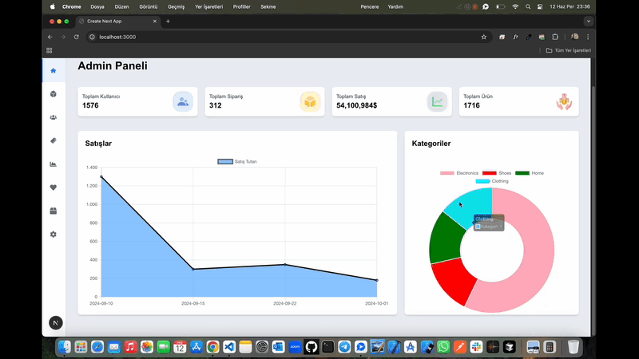

# Admin-Dashboard 🔐

<li>Bu proje React ve Next.js ile hazırlanmış admin-dashboard sitesidir.</li>
<li>Ürün yönetimini kolaylaştırmak amacıyla tasarlanmıştır.(düzenle,ekleme,silme,stok)</li>
<li>Modal yapısı entegre edilerek kullanıcı yönetimi sağlanmıştır.</li>
<li>Kullanıcı sipariş detayları listelenmiştir.</li>
<li>React-Chart.js kütüphanesi ile modern grafiklerle veriler görüntülenmiştir.</li>
<li>Kullanıcı dostu modern responsive tasarımı vardır.</li>

# Kullanılan Teknolojiler 🎨

<li>⭐ TypeScript</li>
<li>⭐ React</li>
<li>⭐ Next.js</li>
<li>⭐ Json-Server</li>
<li>⭐ Tailwindcss</li>
<li>⭐ Toastify</li>
<li>⭐ React-İcons</li>
<li>⭐ React-Chart.js</li>

# Ekran Görüntüsü 🎥
    

# İletişim 📩
yunusemreoral@hotmail.com.tr
